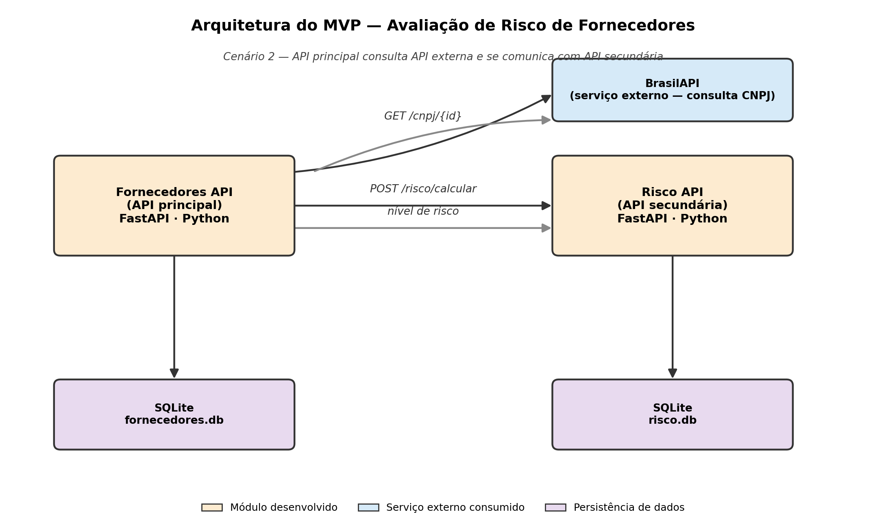

# Fornecedores API

API principal do MVP de avaliação de risco de fornecedores/terceiros. Permite
cadastrar fornecedores a partir do CNPJ, enriquecendo automaticamente os dados
com informações públicas da empresa e com um nível de risco calculado por uma
API secundária.

## Arquitetura



A **Fornecedores API** consulta a **BrasilAPI** (serviço externo) para obter os
dados cadastrais do CNPJ informado e se comunica com a **Risco API** (API
secundária) para obter o nível de risco do fornecedor. Cada componente persiste
seus próprios dados em um banco SQLite independente.

## Funcionalidades

- Cadastro de fornecedores por CNPJ, com enriquecimento automático de dados
- Listagem com filtros (situação cadastral, nível de risco), ordenação e paginação
- Atualização e remoção de registros
- Comunicação automática com a API de risco a cada novo cadastro

## Rotas

| Método | Rota                        | Descrição                              |
|--------|-----------------------------|-----------------------------------------|
| POST   | `/fornecedores`             | Cadastra um fornecedor a partir do CNPJ |
| GET    | `/fornecedores`             | Lista fornecedores (filtros/paginação)  |
| GET    | `/fornecedores/{id}`        | Detalha um fornecedor                   |
| PUT    | `/fornecedores/{id}`        | Atualiza campos de um fornecedor        |
| DELETE | `/fornecedores/{id}`        | Remove um fornecedor                    |

## API externa utilizada

- **Nome:** BrasilAPI
- **Rota consumida:** `GET https://brasilapi.com.br/api/cnpj/v1/{cnpj}`
- **Licença/custo:** pública, gratuita, sem necessidade de autenticação ou cadastro
- **Documentação oficial:** https://brasilapi.com.br/docs#tag/CNPJ

Os dados retornados (razão social, situação cadastral, CNAE principal e
capital social) são tratados e persistidos localmente — a aplicação não
redireciona o usuário para o serviço externo.

## Como executar

### Opção 1 — Docker Compose (recomendado)

Requer que o repositório `risco-api` esteja clonado na pasta irmã desta
(`../risco_api`), pois o `docker-compose.yml` referencia esse caminho para
buildar a segunda API.

```bash
docker compose up --build
```

- Fornecedores API: http://localhost:8000/docs
- Risco API: http://localhost:8001/docs

### Opção 2 — Localmente, sem Docker

```bash
pip install -r requirements.txt
uvicorn app.main:app --reload --port 8000
```

> Também é necessário ter a `risco_api` rodando na porta 8001 (veja o README
> dela), ou definir a variável de ambiente `RISCO_API_URL` apontando para onde
> ela estiver disponível.

## Estrutura do projeto

```
fornecedores_api/
├── app/
│   ├── main.py          # Rotas da API
│   ├── database.py      # Conexão e criação da tabela SQLite
│   ├── schemas.py        # Modelos Pydantic
│   ├── external_api.py   # Integração com a BrasilAPI
│   └── risco_client.py   # Comunicação com a Risco API
├── docs/
│   └── arquitetura_mvp.png
├── docker-compose.yml
├── Dockerfile
└── requirements.txt
```

## Tecnologias

- Python 3.11+
- FastAPI
- SQLite (via `sqlite3`, sem ORM)
- Docker / Docker Compose
